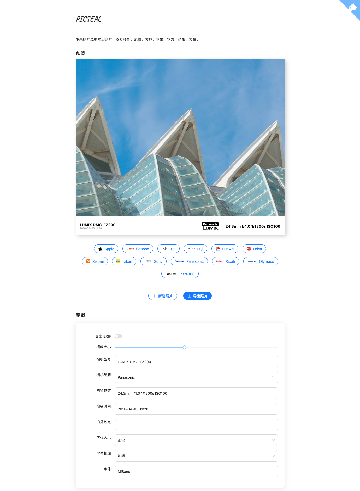

# Picseal

生成类似小米照片风格的莱卡水印照片。支持佳能、尼康、苹果、华为、小米、DJI 等设备的水印生成，可自动识别，也可自定义处理。

## 在线演示

在线试用地址：
- [picseal.vercel.app](https://picseal.vercel.app)
- [picseal.zhiweio.me](https://picseal.zhiweio.me)
- [zhiweio.github.io/picseal](https://zhiweio.github.io/picseal/)



## 技术实现

### EXIF 解析

使用了 Rust 库 `kamadak-exif` 从图片中提取得到 EXIF 信息并借助 WASM 技术嵌入前端 JavaScript 使用。

### 水印生成

通过 HTML 和 CSS 生成水印样式，能够做到动态调整实时预览。

### 图片生成

SDR 输入（JPEG/WebP 等）默认按**原分辨率**合成：1:1 绘制原图 + 原生尺寸水印横幅，色域跟随源（JPEG 按 ICC 判定 P3/sRGB，输出带 ICC），可选回嵌原图 EXIF（方向已归一化）；超出浏览器 canvas 面积/边长上限时回退 `dom-to-image` 预览截图路径。PNG 与 HDR 输入走各自的 WASM 高保真管线（见下表）。

### 格式支持与导出路径

针对常见格式（尤其是 HDR）提供了 Rust/WASM 高保真导出路径，按原分辨率重建水印并保留原始元数据：

| 输入 | 导出路径 | 输出 |
| --- | --- | --- |
| JPEG / WebP 等（SDR，浏览器可解码） | canvas 原分辨率合成（1:1 原图 + 原生 banner，色域跟随源） | JPEG，可选回嵌 EXIF（仅 JPEG） |
| PNG（任意位深，含 16bit） | WASM PNG：原分辨率解码重编码，iCCP/cICP/mDCv/cLLi/XMP/eXIf 等 chunk 字节级直通 | PNG |
| HDR PNG（cICP PQ / HLG，或无 cICP 时按 mDCv/cLLi 判定） | 同上，水印按 BT.2408 参考白（PQ 203nit / HLG 75% 信号）与目标原色编码 | PNG（保留 cICP） |
| Ultra HDR JPEG（gain map JPEG：主图带 hdrgm XMP 或 ISO 21496-1） | WASM Ultra HDR 组装：保留 gain map 与元数据、重写 MPF 目录，水印区域按中性增益（203nit） | Ultra HDR JPEG |
| Apple HDR HEIC（iPhone 拍摄） | 解析 gain map item 与 Apple MakerNote headroom，按 Apple 公式重建 HDR | Ultra HDR JPEG（默认，体积约 PQ PNG 的 1/6～1/12）或 16bit PQ PNG（可选，保真度最高） |
| HEIC（SDR / 非 Apple HDR） | 浏览器原生不支持 HEIC 时经 libheif WASM 按需解码 | JPEG |
| 其他 HDR 输入（Apple 私有风格 gain map JPEG、AVIF 等） | canvas | SDR（上传时提示 HDR 将丢失） |

Ultra HDR JPEG 输出的 ISO 21496-1 元数据采用 Apple / Google 实际文件的规范布局（主图为 version-only 结构标记，参数在 gain map 内以分子/分母对序列化）：实测 Apple 相册正确显示 HDR（ImageIO / CoreImage 校验），并与 Google/Android Ultra HDR 及 Chrome 的解析约定一致。

### 改进

- [ ] 改用 Rust `little_exif` 库来实现对图片 EXIF 信息的读取和编辑。
- [ ] 改用 Canvas 来实现水印，支持高度自定义。

## 部署方法

### 使用 Vercel 部署

|           一键部署到 Vercel            |
| :-----------------------------------: |
| [![][deploy-button-image]][deploy-link] |

### 本地部署

1. **克隆项目代码**：
   ```bash
   git clone https://github.com/zhiweio/picseal
   ```

2. **安装依赖**：
   ```bash
   # 安装 Rustup（编译器）
   curl --proto '=https' --tlsv1.2 -sSf https://sh.rustup.rs | sh -s -- -y

   # 安装 wasm-pack
   curl https://rustwasm.github.io/wasm-pack/installer/init.sh -sSf | sh -s -- -y
   ```

3. **构建并运行**：
   ```bash
   npm install
   npm run build
   npm run preview
   ```

### 使用 GitHub Pages 部署

1. 修改 `vite.config.ts` 中的 `base` 配置为你的 GitHub Pages URL（例如：`https://<USERNAME>.github.io/<REPO>/`）：
   ```javascript
   import wasm from 'vite-plugin-wasm'

   export default defineConfig({
     plugins: [
       react(),
       wasm(),
       visualizer({ open: true }),
     ],
     server: {
       port: 3000,
     },
     build: {
       outDir: 'dist',
       target: 'esnext',
     },
     optimizeDeps: {
       exclude: ['picseal'],
     },
     base: 'https://zhiweio.github.io/picseal/',
   })
   ```

2. **构建并部署**：
   ```bash
   npm install
   npm run pages
   ```

### 使用 Docker 部署

1. 拉取镜像
   ```bash
   docker pull zhiweio/picseal:latest
   ```

2. 启动容器
   ```bash
   docker run -d -p 8080:80 picseal
   ```

3. 访问 http://localhost:8080

## 致谢

HDR 相关能力（Ultra HDR gain map JPEG、Apple HDR HEIC、PQ/HLG PNG）的实现离不开以下开源项目，在此致谢：

### 运行时依赖

- [libheif](https://github.com/strukturag/libheif) / [libde265](https://github.com/strukturag/libde265)（LGPL-3.0）：HEIC 解码。经 [libheif-js](https://github.com/catdad-experiments/libheif-js)（LGPL-3.0）编译为 WASM，仅在浏览器原生不支持 HEIC 时按需加载（独立文件、可替换）
- [kamadak-exif](https://github.com/kamadak/exif-rs)（BSD-2-Clause）：Rust 侧 EXIF 读取
- Rust/WASM 生态：[png](https://github.com/image-rs/image-png)、[crc32fast](https://github.com/srijs/rust-crc32fast)、[serde](https://serde.rs)、[wasm-bindgen](https://github.com/rustwasm/wasm-bindgen)、[gloo-utils](https://github.com/rustwasm/gloo)（均为 MIT / Apache-2.0）

### 参考实现（算法与格式）

- [libultrahdr](https://github.com/google/libultrahdr)（Google，MIT / Apache-2.0）：Ultra HDR / gain map JPEG 参考编解码器。本项目的 MPF 目录布局、gain map 应用数学（`affineMapGain` / `applyGain`）与 ISO 21496-1 元数据解析均参照其实现；ISO 21496-1 写入侧改用 Apple / Google 实际文件的规范布局（主图 version-only 标记 + gain map 分子/分母对、flags=0x40），libultrahdr 草案的公共分母形式会被 Apple/Chrome 解析失败并丢弃 gain map
- [apple-hdr-heic](https://github.com/johncf/apple-hdr-heic)（johncf，MIT）：Apple HDR HEIC 的 gain map 重建方案。本项目的 headroom 推导（Apple MakerNote 分段公式）与重建公式（sRGB EOTF → BT.2020 → PQ 量化，参考白 203nit）即移植自此
- [gainmap-js](https://github.com/MONOGRID/gainmap-js)（MONOGRID，MIT）：MPF/JPEG 零依赖重组的思路参考

### 验证工具（非运行时依赖）

- [exiftool](https://exiftool.org/)（Phil Harvey）：推导并校验 Apple MakerNote 的 HDRHeadroom/HDRGain 参考值
- [libultrahdr](https://github.com/google/libultrahdr) 的 `ultrahdr_app`：Ultra HDR 组装输出经其解码做逐字节回归验证
- macOS ImageIO / CoreImage（Swift 脚本 + `kCIImageExpandToHDR`）：Apple 侧「相册是否显示 HDR」的验收 oracle——`CGImageSourceCopyAuxiliaryDataInfoAtIndex` 检查 gain map 识别，CoreImage 渲染检查增益实际生效
- [apple-hdr-heic](https://github.com/johncf/apple-hdr-heic) CLI + [OpenCV](https://opencv.org/) + [colour-science](https://www.colour-science.org/)：Apple HDR 重建结果与参考实现做像素级对比

## 作者

- [@Wang Zhiwei](https://github.com/zhiweio)

## 开源协议

[MIT](https://choosealicense.com/licenses/mit/)

<!-- 链接配置 -->
[deploy-button-image]: https://vercel.com/button
[deploy-link]: https://vercel.com/new/clone?repository-url=https%3A%2F%2Fgithub.com%2Fzhiweio%2Fpicseal&project-name=picseal&repository-name=picseal
